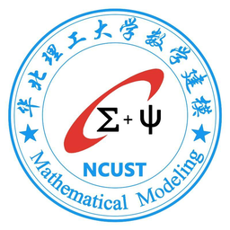

# 简介

    

- 这里是华北理工大学数学建模协会定制的美国大学生数学建模竞赛LaTeX模板。
- 本模板已经在Windows10，MacOS，Linux（Arch）下全线跑通。
- 如果作者不是很忙，会持续跟进每年的美赛模板变动情况，并更新。

# 写在前面

- 当年一起寒暑假不回家，机房培训刷夜一起建模的小伙伴早已各奔东西，入海工作或高校深造音讯越来越少。再次面对这份模板，回忆那段岁月和人，还真有点时过境迁的感慨。
- 不敢说建模有用，毕竟可以造结果，无论是读研还是工作，都会发现建模真的一点用处都没有，实际工程与比赛、论文相差甚远；不敢说建模没用，我校的大多学生都是靠建模拿到各大高校的 offer。
- [更多信息点击这里](https://muyuuuu.github.io/2019/01/15/MCM-template/)。

# 使用

- LaTeX 模板是给有基础的人使用的，不是有了现成的模板就能方便小白，没基础还是驾驭不了。
- `xelatex+bibtex`。保留了ctexart文档类，建议xelatex命令，方便写中文和翻译。
- 还有一点重要的使用方式，学会英文搜索和stackoverflow。
- windows的字体设置参考中文版，Linux的字体设置参考英文版。

# 注意事项

- 珍爱智商，不要看和相信某度，某N，某园，某乎。
- 使用LaTeX之前一定要读过一本**正规**的入门文档，**一定要是正规的**，各类辅导班、教育机构一律不推荐。读完之后达到的最低要求：能区分命令、格式等基础语言，会安装字体，会调用命令行，会自己动手修改任何部分，知道常见语法的含义，知道warning和error如何处理。
- `CTeX`套装已经被历史淘汰，本模板不再支持。
- 学习历程与建议：作者有一定编程基础，这门编程语言前后耗时一个月才算入门并熟悉。言外之意：这不是你一个晚上能搞定的，不要拿来就用，对身体不好。磨刀不误砍柴工，**为了比赛急功近利反而不推荐**，本模板更大的意义想让更多的参赛者方便比赛，学习与认识LaTeX。**更多的奢望**：让参赛者养成良好编程习惯，在今后的学习中（硕士博士）热爱与使用LaTeX，眼光要长远。
- 学习态度：**不学不学我就不学，我要我要我现在就要** 的学习态度不可取。
- 模板代码随意修改，随意传播，你说是你写的也行，一切随意。但你拿来给别人收费就真的无耻了。
- 也欢迎其他各大高校使用，提出建议，毕竟我知道我写的不是很好。

# 本模板的特色与改进部分

- 是基于标准文档类的自定义。
- 此次放上了论文，供使用者参考对照。2018年是我的模拟练习，中文版。2019年是我的一等奖真实论文，英文版。
- 在摘要页做了修改，之前模板的摘要页太少，放不下很多东西，修改后的摘要页可以多写点。某些不符合个人排版习惯的地方均可修改，众所周知，**美赛论文没有固定的模板**，符合自己习惯就好。
- 如上，封装好的美赛模板的第一代作者，我很敬佩，一个有情怀的人。第二代作者，我也很敬佩，才学、见识、生活等方方面面远超于我。**本模板更多的是致敬与学习**。

# 关于提问

- 不要问无脑问题。**不要不看书就问**，`word`是文字编辑工具，`LaTeX`是编程工具，不要以之前的思维来使用`LaTeX`，同样提问不该廉价。
- 了解[正确提问的方式](https://muyuuuu.github.io/2020/01/07/about-qa/)，尤其是代码要正确的提问。而不是拍个照片问哪里错了，该怎么修改。
- 因为每年都被建模参赛用LaTeX的整怕了，问一堆无脑问题，只是为了比赛而比赛，我们可能不会理你。
- deadline一个月以内不推荐使用LaTeX，即使你在比赛很急，我们也只会让你提供MWE慢慢来。

# 关于后期修改

我们是学生，要接受批评，哪里写的不好请直接issue，中英文皆可。模板哪里写的不好你想要喷一下，直接来，多严厉的语言都能接受，谦虚向你学习。

如果，你在2020年及其以后的比赛中使用了这份模板，且取得了不错的成绩，且想分享你的代码和pdf文件。欢迎发给我，一起放到仓库中，我会注明你的学校，做到这个模板的可持续发展。

## 2020年修改

- 根据官网给的新摘要页，重新修改。
- `English-version-2019-MCM-C`和`中文版-2018-MCM-C`这两个版本的代码太烂了，烂到不想承认是我写的。
- 综上：`2020-Summary-change`改进了那两份不好的代码，并修改了摘要页，建议使用这个版本的（附论文）。

